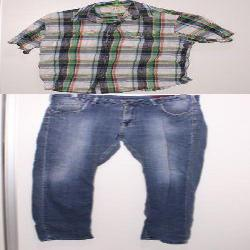
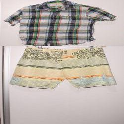

# FashioNet

O projeto nasceu como uma ideia simples para apresentarmos ao final do curso ao lembrarmos de um pedido antigo (mas recorrente) da minha irmã: Aplicativo igual ao que aparece no filme "As patricinhas de Beverly Hills".

A idéia basica é tentar classificar se a parte de cima da roupa (i.e. camiseta) combina com a parte de baixo (i.e., calça ou bermuda).

Infelizmente ~~(ou felizmente)~~ não temos como digitalizar todas as roupas, mas podemos tirar foto de algumas peças para utilizar no _dataset_. Ele foi criado dessa forma a partir das roupas que possuímos.

Com as imagens preparadas, utilizamos a biblioteca `fastai` para treinar duas arquiteturas: _ResNet34_ e _ResNet50_. Dessa forma foi possível consolidar os conhecimentos adquiridos durante o curso e comparar as duas arquiteturas. Acreditavamos que a arquitetura mais complexa pudesse classificar melhor, mas isso não foi observado nos resultados finais.

No final, observamos que a arquitetura _ResNet34_ sobressaiu à _ResNet50_, algo que foi verificado **somente** ao expô-las à imagens não utilizadas no treinamento e validação. Esse passo demonstra a importância de testar os modelos.

# Cadernos

Estão localizados dentro da pasta [`src`](src), sendo: 
* [`nb-train-resnet34.ipynb/nb-train-resnet34.ipynb`](src) - Treinamento da resnet34
* [`nb-train-resnet50.ipynb`](src/nb-train-resnet50.ipynb) - Treinamento da resnet50
* [`testing.ipynb`](src/testing.ipynb) - Testando a rede com imagens não vistas
* [`make-labels.ipynb`](src/make-labels.ipynb) - `Widget` para auxiliar na classificação manual das imagens

# O _dataset_

Foram tiradas fotos das peças individuais, resultando em 19 peças superiores e 15 peças inferiores, que depois foram cortadas para centralizar cada peça. Então combinamos as peças superiores com as inferiores, gerando um total de 285 pares, sendo utilizados 75% para treinamento e 25% para validação.

Após treinamento, também geramos 12 combinações a mais para serem utilizadas no teste das redes.

Todas as imagens resultantes foram redimensionadas para 250x250 pixels para melhor performance da rede - mas você pode testar as originais continas na pasta [`dataset/v1`](dataset/v1) e ver como elas se saem com as mesmas transformações aplicadas pela `fastai` :-)

Nesse sentido, o arquivo [`labeled_v2.csv`](labeled_v2.csv) foi criado através do caderno [`make-labels`](src/make-labels.ipynb), onde contém as classificações corretas para cada imagem - com ajuda externa (obivamente eu sou o meu publico alvo).

Exemplo de algumas imagens geradas:

 

Você consegue dizer qual combina e qual não combina? Se você não consegue, essa ideia também é para você!

# Dependências

Para executar os cadernos se faz necessário a biblioteca [`fastai v1`](https://github.com/fastai/fastai).

# Observações

Reconheço que o código esteja meio sujo e pretendo melhorar isso com o tempo.

# Terminamos com uma foto do maior estilista de todos os tempos

